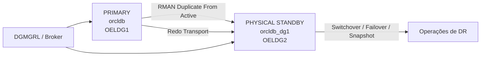

# Oracle Data Guard: Standby Físico com RMAN Duplicate Active e Broker

[English](./README-oracle-data-guard-standby.md) | **Português (Brasil)**


Guia prático em Markdown para criação de um `standby físico` com `RMAN DUPLICATE FROM ACTIVE DATABASE` e administração via `Oracle Data Guard Broker`.

Este material foi adaptado e reorganizado a partir do artigo de Lilian Barroso Yamaguti sobre criação de standby físico com RMAN Duplicate Active e Broker.

> Fonte base: [artigo original no LinkedIn](https://pt.linkedin.com/pulse/criando-um-standby-f%C3%ADsico-via-duplicate-active-e-com-lilian), publicado em 31/08/2021.

## Documentos Relacionados

- [Check diário pós-implementação](./README-check-diario-pos-implementacao.md)

## Quick Start

Se você quer uma visão rápida do fluxo, a sequência é:

1. Preparar o banco primário com `ARCHIVELOG`, `FORCE LOGGING` e `standby redo logs`.
2. Configurar `listener.ora` e `tnsnames.ora` nos dois servidores.
3. Subir a instância auxiliar em `NOMOUNT`.
4. Executar `RMAN DUPLICATE ... FOR STANDBY FROM ACTIVE DATABASE`.
5. Habilitar `DG_BROKER_START` e registrar a configuração no `DGMGRL`.
6. Validar transporte e aplicação de redo.
7. Testar operações como `switchover`, `failover` e `snapshot standby`.

## Sumário

- [Visão Geral](#visão-geral)
- [Cenário de Exemplo](#cenário-de-exemplo)
- [Pré-requisitos](#pré-requisitos)
- [Arquitetura do Fluxo](#arquitetura-do-fluxo)
- [1. Preparar o Banco Primário](#1-preparar-o-banco-primário)
- [2. Configurar o Listener no Primário](#2-configurar-o-listener-no-primário)
- [3. Configurar o Listener no Standby](#3-configurar-o-listener-no-standby)
- [4. Configurar o TNS nos Dois Servidores](#4-configurar-o-tns-nos-dois-servidores)
- [5. Preparar o Servidor Standby](#5-preparar-o-servidor-standby)
- [6. Executar o RMAN Duplicate](#6-executar-o-rman-duplicate)
- [7. Habilitar o Broker](#7-habilitar-o-broker)
- [8. Validar o Ambiente](#8-validar-o-ambiente)
- [9. Configurar a Política de Retenção de Archives](#9-configurar-a-política-de-retenção-de-archives)
- [10. Criar Services para a Aplicação](#10-criar-services-para-a-aplicação)
- [11. Operações Administrativas](#11-operações-administrativas)
- [12. Active Data Guard](#12-active-data-guard)
- [13. Snapshot Standby](#13-snapshot-standby)
- [Troubleshooting](#troubleshooting)
- [Resumo](#resumo)
- [Créditos](#créditos)

## Visão Geral

Este material descreve um procedimento prático para montar um ambiente de `Disaster Recovery (DR)` com `Oracle Data Guard`, criando um banco `standby físico` a partir do banco primário sem necessidade de backup prévio.

O fluxo central usa:

- `RMAN DUPLICATE ... FROM ACTIVE DATABASE`
- `Oracle Data Guard Broker (DGMGRL)`
- Configuração de rede com `listener.ora` e `tnsnames.ora`
- Validações de replicação e operações administrativas do dia a dia

> [!IMPORTANT]
> Os comandos deste guia devem ser adaptados antes do uso em produção. Valide nomes de host, `SID`, `DB_UNIQUE_NAME`, caminhos, portas, tamanho dos redo logs, política de retenção e estratégia de backup conforme o seu ambiente.

## Cenário de Exemplo

Para fins de simulação, o artigo considera:

| Papel | Banco | Host |
| --- | --- | --- |
| Primário | `orcldb` | `OELDG1.legoland` |
| Standby | `orcldb_dg1` | `OELDG2.legoland` |

Exemplos de caminhos:

| Papel | Caminho |
| --- | --- |
| Primário | `/u01/app/oracle/oradata/orcldb/` |
| Standby | `/u01/app/oracle/oradata/orcldb_dg1/` |

## Pré-requisitos

Antes de iniciar, valide:

| Item | Validação |
| --- | --- |
| Sistema operacional | Mesmo sistema operacional nos dois servidores |
| Oracle Home | Mesma versão de binários Oracle |
| Armazenamento | Espaço em disco no standby equivalente ao primário |
| Memória | Memória compatível com a carga esperada |
| Modo do banco | Primário em `ARCHIVELOG` |
| Logging | `FORCE LOGGING` habilitado |
| Flashback | `Flashback Database` habilitado no primário |
| Estrutura | Diretórios e convenções de arquivos coerentes entre os hosts |
| Rede | Resolução de nomes, portas e conectividade entre os servidores |
| Senha SYS | Arquivo de senha compatível entre primário e standby |

## Arquitetura do Fluxo



## 1. Preparar o Banco Primário

Verifique se `FORCE LOGGING` já está habilitado:

```sql
SELECT force_logging FROM v$database;
```

Habilite `FORCE LOGGING`:

```sql
ALTER DATABASE FORCE LOGGING;
```

Adicione `standby redo logs` no primário, preferencialmente na proporção `n + 1` e com o mesmo tamanho dos `online redo logs`.

Consultas de apoio:

```sql
SELECT group#, thread#, sequence#, bytes, archived, status
  FROM v$standby_log
 ORDER BY thread#, group#;

SELECT *
  FROM v$logfile
 WHERE type = 'STANDBY';
```

Exemplo para ambientes com `Automatic Storage Management (ASM)`:

```sql
ALTER DATABASE ADD STANDBY LOGFILE
  THREAD 1 GROUP 10 SIZE 1G,
  THREAD 1 GROUP 11 SIZE 1G,
  THREAD 1 GROUP 12 SIZE 1G;
```

Configure o gerenciamento automático de arquivos no standby:

```sql
ALTER SYSTEM SET STANDBY_FILE_MANAGEMENT=AUTO;
```

## 2. Configurar o Listener no Primário

Exemplo de `listener.ora` no servidor primário:

```ora
LISTENER =
 (DESCRIPTION_LIST =
  (DESCRIPTION =
   (ADDRESS = (PROTOCOL = TCP)(HOST = OELDG1.legoland)(PORT = 1521))
  )
 )

SID_LIST_LISTENER =
 (SID_LIST =
  (SID_DESC =
   (GLOBAL_DBNAME = orcldb_DGMGRL.legoland)
   (ORACLE_HOME = /oracle/product/11.2.0/dbhome_2)
   (SID_NAME = DBORCL)
  )
  (SID_DESC =
   (GLOBAL_DBNAME = orcldb_DGB.legoland)
   (ORACLE_HOME = /oracle/product/11.2.0/dbhome_2)
   (SID_NAME = DBORCL)
  )
 )
```

## 3. Configurar o Listener no Standby

Exemplo de `listener.ora` no servidor standby:

```ora
LISTENER =
 (DESCRIPTION_LIST =
  (DESCRIPTION =
   (ADDRESS = (PROTOCOL = TCP)(HOST = OELDG2.legoland)(PORT = 1521))
  )
 )

SID_LIST_LISTENER =
 (SID_LIST =
  (SID_DESC =
   (GLOBAL_DBNAME = orcldb_dg1_DGMGRL.legoland)
   (ORACLE_HOME = /oracle/product/11.2.0/dbhome_2)
   (SID_NAME = DBORCL)
  )
  (SID_DESC =
   (GLOBAL_DBNAME = orcldb_dg1_DGB.legoland)
   (ORACLE_HOME = /oracle/product/11.2.0/dbhome_2)
   (SID_NAME = DBORCL)
  )
 )
```

## 4. Configurar o TNS nos Dois Servidores

Exemplo de `tnsnames.ora`:

```ora
orcldb =
 (DESCRIPTION =
  (ADDRESS = (PROTOCOL = TCP)(HOST = OELDG1.legoland)(PORT = 1521))
  (CONNECT_DATA =
   (SERVER = DEDICATED)
   (SID = orcldb)
  )
 )

orcldb_dg1 =
 (DESCRIPTION =
  (ADDRESS = (PROTOCOL = TCP)(HOST = OELDG2.legoland)(PORT = 1521))
  (CONNECT_DATA =
   (SERVER = DEDICATED)
   (SID = orcldb_dg1)
  )
 )
```

Recarregue o listener em ambos os hosts:

```bash
lsnrctl reload
```

Valide a conectividade:

```bash
tnsping orcldb
tnsping orcldb_dg1
```

## 5. Preparar o Servidor Standby

Crie um `init.ora` mínimo:

```bash
echo 'DB_NAME = dummy' > "$ORACLE_HOME/dbs/initorcldb_dg1.ora"
```

Crie o arquivo de senha com a mesma senha do primário:

```bash
orapwd file="$ORACLE_HOME/dbs/orapworcldb_dg1" password=senha
```

Suba a instância em `NOMOUNT`:

```sql
STARTUP NOMOUNT;
```

## 6. Executar o RMAN Duplicate

Conecte o `RMAN` ao banco primário e ao auxiliar:

```bash
rman target sys/senha@orcldb auxiliary sys/senha@orcldb_dg1
```

Antes de executar o `duplicate`, ajuste os parâmetros do `spfile` conforme o ambiente de destino.

> [!IMPORTANT]
> Os nomes de banco, grupos ASM, caminhos e parâmetros abaixo são apenas exemplos. Altere os valores conforme o ambiente em questão antes de executar em produção.

Exemplo de parâmetros:

```ini
*.global_names=FALSE
*.db_name='CDBRJPR3'
*.inmemory_size=0
*.db_file_name_convert='+DATAC2','+DATAC2','+RECOC2','+RECOC2'
*.log_file_name_convert='+RECOC2','+RECOC2','+DATAC2','+DATAC2'
```

Execute o `duplicate`:

```rman
RUN
{
  ALLOCATE CHANNEL p1 TYPE DISK;
  ALLOCATE CHANNEL p2 TYPE DISK;
  ALLOCATE AUXILIARY CHANNEL a1 TYPE DISK;
  ALLOCATE AUXILIARY CHANNEL a2 TYPE DISK;

  DUPLICATE TARGET DATABASE FOR STANDBY FROM ACTIVE DATABASE;
}
```

### Observações importantes sobre o comando

- `FOR STANDBY`: cria o banco como standby sem trocar o `DBID`.
- `FROM ACTIVE DATABASE`: copia os datafiles diretamente da origem, sem backup prévio.
- `DORECOVER`: opção útil quando se deseja incluir a etapa de recuperação e aproximar o standby do ponto atual no tempo.

## 7. Habilitar o Broker

Nos dois bancos:

```sql
ALTER SYSTEM SET DG_BROKER_START=TRUE;
```

No servidor primário, crie e habilite a configuração no `DGMGRL`:

```text
DGMGRL> CONNECT sys/senha@DBORCL
DGMGRL> CREATE CONFIGURATION DBORCL_DR AS PRIMARY DATABASE IS DBORCL CONNECT IDENTIFIER IS DBORCL;
DGMGRL> ADD DATABASE DBORCL_DG1 AS CONNECT IDENTIFIER IS DBORCL_DG1 MAINTAINED AS PHYSICAL;
DGMGRL> SHOW CONFIGURATION;
DGMGRL> ENABLE CONFIGURATION;
```

## 8. Validar o Ambiente

Verifique o papel e o modo de abertura de cada banco:

```sql
SELECT db_unique_name,
       open_mode,
       protection_mode,
       protection_level,
       database_role
  FROM v$database;
```

Valide a replicação:

```sql
SELECT MAX(sequence#), thread#, MAX(first_time) AS time
  FROM v$log_history
 GROUP BY thread#;

SELECT process, status, sequence#, block#
  FROM v$managed_standby;
```

Também é possível verificar o estado pelo `Broker`:

```text
DGMGRL> SHOW CONFIGURATION;
DGMGRL> SHOW DATABASE DBORCL_DG1;
```

## 9. Configurar a Política de Retenção de Archives

No `RMAN`, configure a política para apagar `archivelogs` apenas depois de aplicados no standby:

```rman
CONFIGURE ARCHIVELOG DELETION POLICY TO APPLIED ON STANDBY;
```

## 10. Criar Services para a Aplicação

Criar um `application service` ajuda a tornar operações de `switchover` mais transparentes para os clientes.

Exemplo:

```sql
BEGIN
  DBMS_SERVICE.CREATE_SERVICE(
    service_name      => 'DBORCL',
    network_name      => 'DBORCL',
    failover_method   => 'BASIC',
    failover_type     => 'SELECT',
    failover_retries  => 180,
    failover_delay    => 1
  );
END;
/
```

Para iniciar o serviço automaticamente apenas quando o banco estiver como `PRIMARY`, crie uma trigger:

```sql
CREATE OR REPLACE TRIGGER start_app_service
  AFTER STARTUP
  ON DATABASE
DECLARE
  role VARCHAR2(30);
BEGIN
  SELECT database_role INTO role FROM v$database;

  IF role = 'PRIMARY' THEN
    DBMS_SERVICE.START_SERVICE('DBORCL');
  END IF;
END;
/
```

> Em ambientes com `Grid Infrastructure`, essa administração pode ser feita via `srvctl`.

Exemplo de `tnsnames.ora` para clientes apontando para os dois hosts:

```ora
DBORCL =
 (DESCRIPTION =
  (ADDRESS_LIST =
   (ADDRESS = (PROTOCOL = TCP)(HOST = OELDG1.legoland)(PORT = 1521))
   (ADDRESS = (PROTOCOL = TCP)(HOST = OELDG2.legoland)(PORT = 1521))
  )
  (CONNECT_DATA =
   (SERVICE_NAME = DBORCL)
  )
 )
```

## 11. Operações Administrativas

### Switchover

```text
DGMGRL> SWITCHOVER TO DBORCL_DG1;
DGMGRL> SHOW CONFIGURATION;
DGMGRL> SWITCHOVER TO DBORCL;
DGMGRL> SHOW CONFIGURATION;
```

Confirme se o `Flashback Database` está habilitado:

```sql
SELECT flashback_on FROM v$database;
```

### Failover

Se o banco primário não estiver disponível:

```text
DGMGRL> FAILOVER TO DBORCL_DG1;
DGMGRL> SHOW CONFIGURATION;
```

Se o banco primário original tiver `Flashback Database` habilitado, ele poderá ser reintegrado como standby:

```text
DGMGRL> REINSTATE DATABASE DBORCL;
```

Sem `Flashback Database`, o primário original precisará ser recriado manualmente como standby.

## 12. Active Data Guard

Para abrir o standby em `READ ONLY` e continuar aplicando redo:

```sql
ALTER DATABASE RECOVER MANAGED STANDBY DATABASE CANCEL;
ALTER DATABASE OPEN READ ONLY;
ALTER DATABASE RECOVER MANAGED STANDBY DATABASE USING CURRENT LOGFILE DISCONNECT FROM SESSION;
```

> Em versões acima de `12c`, o uso de `USING CURRENT LOGFILE` permanece compatível, mas é citado no artigo como depreciado.

## 13. Snapshot Standby

Para abrir temporariamente o standby em `READ WRITE` para testes:

```sql
STARTUP MOUNT;
ALTER DATABASE CONVERT TO SNAPSHOT STANDBY;
ALTER DATABASE OPEN;
```

Verifique o estado atual:

```sql
SELECT flashback_on FROM v$database;
```

Para voltar de `snapshot standby` para `physical standby`:

```sql
SHUTDOWN IMMEDIATE;
STARTUP NOMOUNT;
ALTER DATABASE MOUNT STANDBY DATABASE;
ALTER DATABASE RECOVER MANAGED STANDBY DATABASE USING CURRENT LOGFILE DISCONNECT FROM SESSION;
```

## Troubleshooting

### O `RMAN duplicate` não conecta no banco auxiliar

Verifique primeiro:

- Instância auxiliar iniciada em `NOMOUNT`
- `listener` ativo nos dois hosts
- Entradas corretas no `tnsnames.ora`
- Arquivo de senha presente e com a mesma senha do primário

Comandos úteis:

```bash
tnsping orcldb
tnsping orcldb_dg1
lsnrctl status
```

### O standby não aplica archives

Se o banco foi criado, mas o apply não anda, revise:

- Presença de `standby redo logs`
- `DG_BROKER_START=TRUE` quando estiver usando `Broker`
- Status do `MRP`
- Transporte e recepção de redo entre os hosts

Consultas úteis:

```sql
SELECT process, status, thread#, sequence#
  FROM v$managed_standby;

SELECT dest_id, status, error
  FROM v$archive_dest_status
 ORDER BY dest_id;
```

### O `Broker` mostra aviso ou erro de configuração

Quando o `DGMGRL` retornar `WARNING` ou `ERROR`, confira:

- `DB_UNIQUE_NAME` de cada banco
- `connect identifier` usados na configuração
- Resolução de nome no `tnsnames.ora`
- Parâmetros de rede e listener estático para o `Broker`

Comandos úteis:

```text
DGMGRL> SHOW CONFIGURATION;
DGMGRL> SHOW DATABASE VERBOSE DBORCL;
DGMGRL> SHOW DATABASE VERBOSE DBORCL_DG1;
```

### O switchover ou failover não conclui

Antes da troca de papéis, confirme:

- Standby sincronizado ou com lag aceitável
- `Flashback Database` habilitado, principalmente se houver plano de `reinstate`
- Serviços da aplicação preparados para o novo `PRIMARY`

Consultas úteis:

```sql
SELECT name, value, unit
  FROM v$dataguard_stats;

SELECT flashback_on, database_role, open_mode
  FROM v$database;
```

## Resumo

Esse fluxo combina rapidez operacional com uma administração mais simples:

- Criação do standby sem backup prévio
- Menor impacto no primário durante a montagem
- Gerenciamento centralizado com `Broker`
- Suporte a operações como `switchover`, `failover`, `reinstate`, `Active Data Guard` e `Snapshot Standby`

## Créditos

Conteúdo estruturado a partir do artigo original de Lilian Barroso Yamaguti, reorganizado aqui em formato de documentação técnica para uso em repositórios GitHub.
