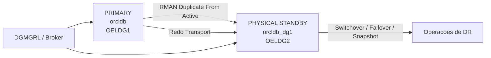

# Oracle Data Guard: Standby Fisico com RMAN Duplicate Active e Broker


Guia em `Markdown` para GitHub, adaptado do artigo da Lilian Barroso Yamaguti sobre criacao de um `standby fisico` com `RMAN duplicate from active database` e gerenciamento via `Data Guard Broker`.

> Fonte base: [artigo original no LinkedIn](https://pt.linkedin.com/pulse/criando-um-standby-f%C3%ADsico-via-duplicate-active-e-com-lilian), publicado em 31/08/2021.

## Documentos Relacionados

- [Check diario pos-implementacao](./README-check-diario-pos-implementacao.md)

## Quick Start

Se voce quer uma visao rapida do fluxo, a sequencia e esta:

1. preparar o banco primario com `ARCHIVELOG`, `FORCE LOGGING` e `standby redo logs`
2. configurar `listener.ora` e `tnsnames.ora` nos dois servidores
3. subir a instancia auxiliar em `NOMOUNT`
4. executar `RMAN DUPLICATE ... FOR STANDBY FROM ACTIVE DATABASE`
5. habilitar `DG_BROKER_START` e registrar a configuracao no `DGMGRL`
6. validar transporte e apply de redo
7. testar operacoes como `switchover`, `failover` e `snapshot standby`

## Sumario

- [Quick Start](#quick-start)
- [Visao Geral](#visao-geral)
- [Cenario de Exemplo](#cenario-de-exemplo)
- [Pre-requisitos](#pre-requisitos)
- [Arquitetura do Fluxo](#arquitetura-do-fluxo)
- [1. Preparar o Banco Primario](#1-preparar-o-banco-primario)
- [2. Configurar o Listener no Primario](#2-configurar-o-listener-no-primario)
- [3. Configurar o Listener no Standby](#3-configurar-o-listener-no-standby)
- [4. Configurar o TNS nos Dois Servidores](#4-configurar-o-tns-nos-dois-servidores)
- [5. Preparar o Servidor Standby](#5-preparar-o-servidor-standby)
- [6. Executar o RMAN Duplicate](#6-executar-o-rman-duplicate)
- [7. Habilitar o Broker](#7-habilitar-o-broker)
- [8. Validar o Ambiente](#8-validar-o-ambiente)
- [9. Configurar a Politica de Retencao de Archives](#9-configurar-a-politica-de-retencao-de-archives)
- [10. Criar Services para a Aplicacao](#10-criar-services-para-a-aplicacao)
- [11. Operacoes Administrativas](#11-operacoes-administrativas)
- [12. Active Data Guard](#12-active-data-guard)
- [13. Snapshot Standby](#13-snapshot-standby)
- [Troubleshooting](#troubleshooting)
- [Resumo](#resumo)
- [Creditos](#creditos)

## Visao Geral

Este material descreve um procedimento pratico para montar um ambiente de `Disaster Recovery (DR)` com `Oracle Data Guard`, criando um banco `standby fisico` a partir do banco primario sem necessidade de backup previo.

O fluxo central usa:

- `RMAN DUPLICATE ... FROM ACTIVE DATABASE`
- `Oracle Data Guard Broker (DGMGRL)`
- configuracao de rede com `listener.ora` e `tnsnames.ora`
- validacoes de replicacao e operacoes administrativas do dia a dia

## Cenario de Exemplo

Para fins de simulacao, o artigo considera:

- banco primario: `orcldb` no host `OELDG1.legoland`
- banco standby: `orcldb_dg1` no host `OELDG2.legoland`

Adapte nomes de host, `SID`, `DB_UNIQUE_NAME`, caminhos e portas conforme o seu ambiente.

## Pre-requisitos

Antes de iniciar, valide:

| Item | Validacao |
| --- | --- |
| Sistema operacional | Mesmo sistema operacional nos dois servidores |
| Oracle Home | Mesma versao de binarios Oracle |
| Armazenamento | Espaco em disco no standby equivalente ao primario |
| Memoria | Memoria compativel com a carga esperada |
| Modo do banco | Primario em `ARCHIVELOG` |
| Logging | `FORCE LOGGING` habilitado |
| Flashback | `Flashback Database` habilitado no primario |
| Estrutura | Diretorios e convencoes de arquivos coerentes entre os hosts |

- mesmo sistema operacional nos dois servidores
- mesma versao de binarios Oracle
- espaco em disco no servidor standby equivalente ao primario
- memoria no servidor standby equivalente ao primario
- banco primario em `ARCHIVELOG`
- banco primario com `FORCE LOGGING`
- `Flashback Database` habilitado no primario
- estrutura de diretorios equivalente entre primario e standby

Exemplo de caminhos:

- primario: `/u01/app/oracle/oradata/orcldb/`
- standby: `/u01/app/oracle/oradata/orcldb_dg1/`

## Arquitetura do Fluxo



## 1. Preparar o Banco Primario

Query para verificar se ja esta habilitado:

```sql
SELECT force_logging FROM v$database;
```

Habilite `force logging`:

```sql
ALTER DATABASE FORCE LOGGING;
```

Adicione `standby redo logs` no primario, preferencialmente em proporcao `n+1` e com o mesmo tamanho dos `online redo logs`:

Query de apoio para verificar logfiles ja criados no ambiente

```sql
SELECT GROUP#, THREAD#, SEQUENCE#, BYTES, ARCHIVED, STATUS
FROM V$STANDBY_LOG
ORDER BY THREAD#, GROUP#;

SELECT * FROM V$LOGFILE
WHERE TYPE = 'STANDBY';
```

```sql
-- Automatic Storage Management (ASM):
-- Comandos para adicionar log files, criar para o mesmo numero de Thread
-- e seguindo a sequencia dos Group ja criados.
ALTER DATABASE ADD STANDBY LOGFILE
  THREAD 1 GROUP 10 SIZE 1G,
  THREAD 1 GROUP 11 SIZE 1G,
  THREAD 1 GROUP 12 SIZE 1G;
```

Confirme o parametro `STANDBY_FILE_MANAGEMENT`:

```sql
ALTER SYSTEM SET STANDBY_FILE_MANAGEMENT=AUTO;
```

## 2. Configurar o Listener no Primario

Exemplo de `listener.ora` no servidor primario:

```ora
LISTENER =
 (DESCRIPTION_LIST =
  (DESCRIPTION =
   (ADDRESS = (PROTOCOL = TCP)(HOST = OELDG1.legoland)(PORT = 1521))
  )
 )

SID_LIST_LISTENER =
 (SID_LIST =
  (SID_DESC =
   (GLOBAL_DBNAME = orcldb_DGMGRL.legoland)
   (ORACLE_HOME = /oracle/product/11.2.0/dbhome_2)
   (SID_NAME = DBORCL)
  )
  (SID_DESC =
   (GLOBAL_DBNAME = orcldb_DGB.legoland)
   (ORACLE_HOME = /oracle/product/11.2.0/dbhome_2)
   (SID_NAME = DBORCL)
  )
 )
```

## 3. Configurar o Listener no Standby

Exemplo de `listener.ora` no servidor standby:

```ora
LISTENER =
 (DESCRIPTION_LIST =
  (DESCRIPTION =
   (ADDRESS = (PROTOCOL = TCP)(HOST = OELDG2.legoland)(PORT = 1521))
  )
 )

SID_LIST_LISTENER =
 (SID_LIST =
  (SID_DESC =
   (GLOBAL_DBNAME = orcldb_dg1_DGMGRL.legoland)
   (ORACLE_HOME = /oracle/product/11.2.0/dbhome_2)
   (SID_NAME = DBORCL)
  )
  (SID_DESC =
   (GLOBAL_DBNAME = orcldb_dg1_DGB.legoland)
   (ORACLE_HOME = /oracle/product/11.2.0/dbhome_2)
   (SID_NAME = DBORCL)
  )
 )
```

## 4. Configurar o TNS nos Dois Servidores

Exemplo de `tnsnames.ora`:

```ora
orcldb =
 (DESCRIPTION =
  (ADDRESS = (PROTOCOL = TCP)(HOST = OELDG1.legoland)(PORT = 1521))
  (CONNECT_DATA =
   (SERVER = DEDICATED)
   (SID = orcldb)
  )
 )

orcldb_dg1 =
 (DESCRIPTION =
  (ADDRESS = (PROTOCOL = TCP)(HOST = OELDG2.legoland)(PORT = 1521))
  (CONNECT_DATA =
   (SERVER = DEDICATED)
   (SID = orcldb_dg1)
  )
 )
```

Recarregue o listener em ambos os hosts:

```bash
lsnrctl reload
```

## 5. Preparar o Servidor Standby

Crie um `init.ora` minimo:

```bash
echo 'DB_NAME = dummy' > $ORACLE_HOME/dbs/initorcldb_dg1.ora
```

Crie o arquivo de senha com a mesma senha do primario:

```bash
orapwd file=$ORACLE_HOME/dbs/orapworcldb_dg1 password=senha
```

Suba a instancia em `NOMOUNT`:

```sql
STARTUP NOMOUNT;
```

## 6. Executar o RMAN Duplicate

Conecte o `RMAN` ao banco primario e ao auxiliar:

```bash
rman target sys/senha@orcldb auxiliary sys/senha@orcldb_dg1
```

Execute o `duplicate`:

```rman
RUN
{
  ALLOCATE CHANNEL p1 TYPE DISK;
  ALLOCATE CHANNEL p2 TYPE DISK;
  ALLOCATE AUXILIARY CHANNEL a1 TYPE DISK;

  DUPLICATE TARGET DATABASE FOR STANDBY FROM ACTIVE DATABASE
    SPFILE
    PARAMETER_VALUE_CONVERT 'DBORCL','DBORCL_DG1'
    SET DB_UNIQUE_NAME='DBORCL_DG1'
    SET CONTROL_FILES='/oracle/oradata/DBORCL_DG1/controlfile/ctlfile_01.ctl',
                      '/oracle/flash_recovery_area/DBORCL_DG1/controlfile/ctlfile_02.ctl'
    SET DB_CREATE_FILE_DEST='/oracle/oradata'
    SET DB_CREATE_ONLINE_LOG_DEST_1='/oracle/oradata'
    SET DB_CREATE_ONLINE_LOG_DEST_2='/oracle/flash_recovery_area'
    SET DB_RECOVERY_FILE_DEST='/oracle/flash_recovery_area'
    SET DB_RECOVERY_FILE_DEST_SIZE='5G'
    NOFILENAMECHECK;
}
```

### Observacoes importantes sobre o comando

- `FOR STANDBY`: cria o banco como standby sem trocar o `DBID`
- `FROM ACTIVE DATABASE`: copia os datafiles diretamente da origem, sem backup previo
- `SPFILE`: permite ajustar parametros durante a copia do `spfile`
- `NOFILENAMECHECK`: nao valida conflitos de nomes de arquivos no destino

O artigo tambem destaca a clausula `DORECOVER` como opcao util quando se deseja incluir a etapa de recuperacao e aproximar o standby do ponto atual no tempo.

## 7. Habilitar o Broker

Nos dois bancos:

```sql
ALTER SYSTEM SET DG_BROKER_START=TRUE;
```

No servidor primario, crie e habilite a configuracao no `DGMGRL`:

```text
DGMGRL> CONNECT sys/senha@DBORCL
DGMGRL> CREATE CONFIGURATION DBORCL_DR AS PRIMARY DATABASE IS DBORCL CONNECT IDENTIFIER IS DBORCL;
DGMGRL> ADD DATABASE DBORCL_DG1 AS CONNECT IDENTIFIER IS DBORCL_DG1 MAINTAINED AS PHYSICAL;
DGMGRL> SHOW CONFIGURATION;
DGMGRL> ENABLE CONFIGURATION;
```

## 8. Validar o Ambiente

Verifique o papel e modo de abertura de cada banco:

```sql
SELECT db_unique_name,
       open_mode,
       protection_mode,
       protection_level,
       database_role
  FROM v$database;
```

Valide a replicacao:

```sql
SELECT MAX(sequence#), thread#, MAX(first_time) AS time
  FROM v$log_history
 GROUP BY thread#;

SELECT process, status, sequence#, block#
  FROM v$managed_standby;
```

Tambem e possivel verificar o estado pelo `Broker`:

```text
DGMGRL> SHOW CONFIGURATION;
DGMGRL> SHOW DATABASE DBORCL_DG1;
```

## 9. Configurar a Politica de Retencao de Archives

No `RMAN`, configure a politica para apagar `archivelogs` apenas depois de aplicados no standby:

```rman
CONFIGURE ARCHIVELOG DELETION POLICY TO APPLIED ON STANDBY;
```

## 10. Criar Services para a Aplicacao

Criar um `application service` ajuda a tornar operacoes de `switchover` mais transparentes para os clientes.

Exemplo:

```sql
BEGIN
  DBMS_SERVICE.CREATE_SERVICE(
    service_name      => 'DBORCL',
    network_name      => 'DBORCL',
    failover_method   => 'BASIC',
    failover_type     => 'SELECT',
    failover_retries  => 180,
    failover_delay    => 1
  );
END;
/
```

Para iniciar o servico automaticamente apenas quando o banco estiver como `PRIMARY`, crie uma trigger:

```sql
CREATE OR REPLACE TRIGGER start_app_service
  AFTER STARTUP
  ON DATABASE
DECLARE
  role VARCHAR2(30);
BEGIN
  SELECT database_role INTO role FROM v$database;

  IF role = 'PRIMARY' THEN
    DBMS_SERVICE.START_SERVICE('DBORCL');
  END IF;
END;
/
```

> Em ambientes com `Grid Infrastructure`, essa administracao pode ser feita via `srvctl`.

Exemplo de `tnsnames.ora` para clientes apontando para os dois hosts:

```ora
DBORCL =
 (DESCRIPTION =
  (ADDRESS_LIST =
   (ADDRESS = (PROTOCOL = TCP)(HOST = OELDG1.legoland)(PORT = 1521))
   (ADDRESS = (PROTOCOL = TCP)(HOST = OELDG2.legoland)(PORT = 1521))
  )
  (CONNECT_DATA =
   (SERVICE_NAME = DBORCL)
  )
 )
```

## 11. Operacoes Administrativas

### Switchover

```text
DGMGRL> SWITCHOVER TO DBORCL_DG1;
DGMGRL> SHOW CONFIGURATION;
DGMGRL> SWITCHOVER TO DBORCL;
DGMGRL> SHOW CONFIGURATION;
```

Confirme se o `Flashback Database` esta habilitado:

```sql
SELECT flashback_on FROM v$database;
```

### Failover

Se o banco primario nao estiver disponivel:

```text
DGMGRL> FAILOVER TO DBORCL_DG1;
DGMGRL> SHOW CONFIGURATION;
```

Se o banco primario original tiver `Flashback Database` habilitado, ele podera ser reintegrado como standby:

```text
DGMGRL> REINSTATE DATABASE DBORCL;
```

Sem `flashback`, o primario original precisara ser recriado manualmente como standby.

## 12. Active Data Guard

Para abrir o standby em `read only` e continuar aplicando redo:

```sql
ALTER DATABASE RECOVER MANAGED STANDBY DATABASE CANCEL;
ALTER DATABASE OPEN READ ONLY;
ALTER DATABASE RECOVER MANAGED STANDBY DATABASE USING CURRENT LOGFILE DISCONNECT FROM SESSION;
```

> Em versoes acima de `12c`, o uso de `USING CURRENT LOGFILE` permanece compativel, mas e citado no artigo como depreciado.

## 13. Snapshot Standby

Para abrir temporariamente o standby em `read write` para testes:

```sql
STARTUP MOUNT;
ALTER DATABASE CONVERT TO SNAPSHOT STANDBY;
ALTER DATABASE OPEN;
```

Verifique o estado atual:

```sql
SELECT flashback_on FROM v$database;
```

Para voltar de `snapshot standby` para `physical standby`:

```sql
SHUTDOWN IMMEDIATE;
STARTUP NOMOUNT;
ALTER DATABASE MOUNT STANDBY DATABASE;
ALTER DATABASE RECOVER MANAGED STANDBY DATABASE USING CURRENT LOGFILE DISCONNECT FROM SESSION;
```

## Troubleshooting

### O `RMAN duplicate` nao conecta no banco auxiliar

Verifique primeiro:

- instancia auxiliar iniciada em `NOMOUNT`
- `listener` ativo nos dois hosts
- entradas corretas no `tnsnames.ora`
- arquivo de senha presente e com a mesma senha do primario

Comandos uteis:

```bash
tnsping orcldb
tnsping orcldb_dg1
lsnrctl status
```

### O standby nao aplica archives

Se o banco foi criado, mas o apply nao anda, revise:

- presenca de `standby redo logs`
- `DG_BROKER_START=TRUE` quando estiver usando `Broker`
- status do `MRP`
- transporte e recepcao de redo entre os hosts

Consultas uteis:

```sql
SELECT process, status, thread#, sequence#
  FROM v$managed_standby;

SELECT dest_id, status, error
  FROM v$archive_dest_status
 ORDER BY dest_id;
```

### O `Broker` mostra aviso ou erro de configuracao

Quando o `DGMGRL` retornar `WARNING` ou `ERROR`, confira:

- `DB_UNIQUE_NAME` de cada banco
- `connect identifier` usados na configuracao
- resolucao de nome no `tnsnames.ora`
- parametros de rede e listener estatico para o `Broker`

Comandos uteis:

```text
DGMGRL> SHOW CONFIGURATION;
DGMGRL> SHOW DATABASE VERBOSE DBORCL;
DGMGRL> SHOW DATABASE VERBOSE DBORCL_DG1;
```

### O switchover ou failover nao conclui

Antes da troca de papeis, confirme:

- standby sincronizado ou com lag aceitavel
- `Flashback Database` habilitado, principalmente se houver plano de `reinstate`
- servicos da aplicacao preparados para o novo `PRIMARY`

Consultas uteis:

```sql
SELECT name, value, unit
  FROM v$dataguard_stats;

SELECT flashback_on, database_role, open_mode
  FROM v$database;
```

## Resumo

Esse fluxo combina rapidez operacional com uma administracao mais simples:

- criacao do standby sem backup previo
- menor impacto no primario durante a montagem
- gerenciamento centralizado com `Broker`
- suporte a operacoes como `switchover`, `failover`, `reinstate`, `Active Data Guard` e `Snapshot Standby`

## Creditos

Conteudo estruturado a partir do artigo original de Lilian Barroso Yamaguti, reorganizado aqui em formato de documentacao tecnica para uso em repositorios GitHub.
